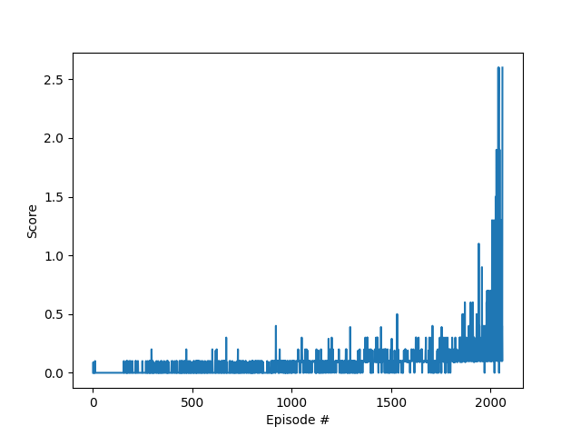

# Report for Tennis
## Learning Algorithms
I've implemented the DDPG algorithm ([paper](https://arxiv.org/abs/1509.02971)).

As optimizer, [Adam optimizer](https://arxiv.org/abs/1412.6980) is used in all algorithms.

In order to let two agents collaborate, I've constructed an integrated agent to control two agents simultaneously. This agent receives a concatenated observations of two rackets and outputs a four dimensional values corresponding to two rackets' actions.

## Model
- Critic Model
  
Multi-Layer-Perceptron with three layers, with the batch normalization for the first hidden layer, the spectral normalization for the second hidden layer,  and 128 hidden units. 

- Actor Model

Multi-Layer Perceptron with three layers, batch normalization for the first hidden layer, and 128 hidden units. 

## Hyper-Parameters
I used the following hyper-parameters.
- Batchsize: 256
- Number of hidden units: 256
- Learning rate for Actor model: 1e-04 
- Learning rate for Critic model: 1e-04 
- Gamma: 0.99
- Buffer size: 1e5
- Tau for soft update: 1e-3
- Noise Variance: 1.0
- Update Every: 2
- Number of Updates: 3

## Results
As the following graph shows, the algorithm succeeded to attain the required rewards in 1961 episodes, 

## Future Work
- Introduce rollouts and set loss as TD_lambda and generalized advantages estimator